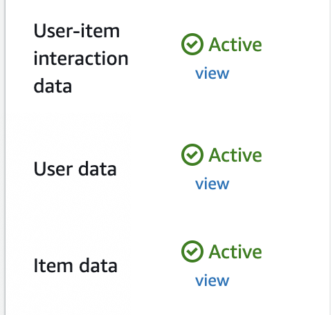
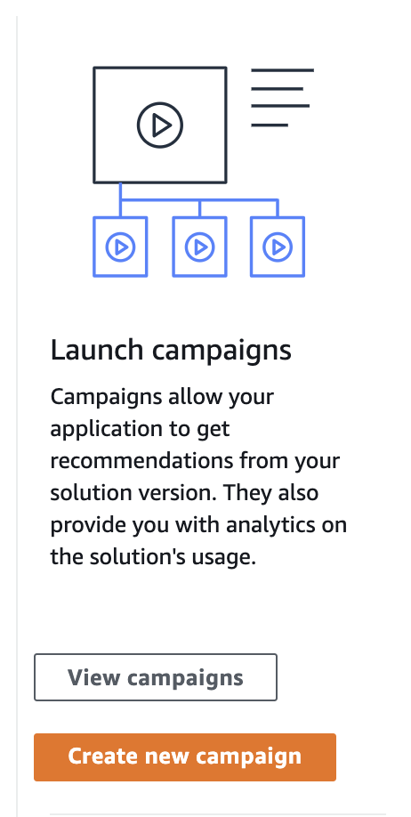

<p align="center">
    
</p>

This lab is provided as part of **[AWS Innovate Data Edition](https://aws.amazon.com/events/aws-innovate/data/)**, click [here](https://github.com/phonghuule/aws-innovate-data) to explore the full list of hands-on labs.

:information_source: You will run this lab in your own AWS account. Please follow directions at the end of the lab to remove resources to avoid future costs.

--------

## Creating a recommendation using Amazon Personalize
In this lab you will learn the basics of how to use Amazon Personalize in order to create a recommendation system. Be aware that the data upload and training steps do take a long period to perform. 

Amazon Personalize is a service which is based off the same technology used at Amazon.com. Amazon Personalize is designed for users who would like to have a managed recommendation engine, but may not have the experience required to build their own.


Due to the import, training and creation of a recommendation engine, be prepared for a lengthy time period waiting for the service to finish.

In this lab, we will be creating and associating resources for Aamzon Personalize in the **Sydney** region. You can easily use Amazon Personalize in [other supported regions](https://aws.amazon.com/about-aws/global-infrastructure/regional-product-services/).

For pricing, please refer to the [pricing page](https://aws.amazon.com/personalize/pricing/).

| Estimated Time | Estimated Cost |
| ---- | ---- |
| 1.5hrs | Free ( Free Trial ) |

----

## Contents
1. [Concepts & Definitions](https://github.com/Deenbe/aws-labs/blob/master/personalise/personalise.md#1-concepts--definitions)
2. [Preparing your data](https://github.com/Deenbe/aws-labs/blob/master/personalise/personalise.md#2-preparing-your-data)

    2.1 [Create a S3 Bucket](https://github.com/Deenbe/aws-labs/blob/master/personalise/personalise.md#21-create-a-s3-bucket)
3. [Create IAM Policy](https://github.com/Deenbe/aws-labs/blob/master/personalise/personalise.md#3-create-iam-policy)

    3.1 [IAM Role Policies](https://github.com/Deenbe/aws-labs/blob/master/personalise/personalise.md#31-iam-role-policies)

    3.2 [Trusted Entity](https://github.com/Deenbe/aws-labs/blob/master/personalise/personalise.md#32-trusted-entity)
4. [Creating your Personalize Dataset Group](https://github.com/Deenbe/aws-labs/blob/master/personalise/personalise.md#4-creating-your-personalize-dataset-group)

    4.1 [Creating your Dataset](https://github.com/Deenbe/aws-labs/blob/master/personalise/personalise.md#41-creating-your-dataset)

    4.2 [Dataset Details & Schema](https://github.com/Deenbe/aws-labs/blob/master/personalise/personalise.md#42-dataset-details--schema)

    4.3 [Importing Data](https://github.com/Deenbe/aws-labs/blob/master/personalise/personalise.md#43-importing-data-30mins)
5. [Creating & Training your Personalize Solution](https://github.com/Deenbe/aws-labs/blob/master/personalise/personalise.md#5-creating--training-your-personalize-solution-40mins)

    5.1 [Creating the Solution](https://github.com/Deenbe/aws-labs/blob/master/personalise/personalise.md#51-creating-the-solution)
6. [Create a Campaign](https://github.com/Deenbe/aws-labs/blob/master/personalise/personalise.md#6-create-a-campaign-20mins)
7. [Retrieving a Recommendation](https://github.com/Deenbe/aws-labs/blob/master/personalise/personalise.md#7-retrieving-a-recommendation)
8. [Personalize CLI](https://github.com/Deenbe/aws-labs/blob/master/personalise/personalise.md#8-personalize-cli)
9. [Personalize Programmatic SDK](https://github.com/Deenbe/aws-labs/blob/master/personalise/personalise.md#9-personalize-programmatic-sdk)
10. [Where to from here?](https://github.com/Deenbe/aws-labs/blob/master/personalise/personalise.md#10-where-to-from-here)
11. [ML Ops, Automation, Filtering and Leveraging Contextual Information](https://github.com/Deenbe/aws-labs/blob/master/personalise/personalise.md#11-ML-Ops,-Automation,-Filtering-and-Leveraging-Contextual-Information)
12. [Survey](https://github.com/Deenbe/aws-labs/blob/master/personalise/personalise.md#12-survey)
13. [Author & Feedback](https://github.com/Deenbe/aws-labs/blob/master/personalise/personalise.md#13-author--feedback)
  
----

## 1. Concepts & Definitions

In order to understand how Amazon Personalize works, we need to refer to some terminology:

- **Dataset Groups**

    A Dataset Group are domain specific containers for your recommendations

- **Datasets**

    Datasets are data used in order to create solutions which then generate recommendations

- **Schema**

    The datasets which you will use in Personalise needs a Schema defined before import, this is provided as a JSON string.

- **Solution**

    A solution is a custom model generated on your datasets to provide recommendations

- **Launch Campaign**

    A campaign allows an application to retrieve recommendations. Analytics on a campaign's usage is also available

At a high order, the process is as follows:

1. Import datasets and associate their appropriate schema
2. Train the model by selecting a Recipe

----

## 2. Preparing your data

In order to use personalize, you need to have a csv dataset for each of these types:

1. Users
2. Items
3. User-Item Interactions

Preferrably, you would use all three to achieve the best results.

Please download all the files below:

| Name     | Schema | Data File |
| ---- | ---- | ---- |
| item.csv | [items_schema.json](./schema/item.json) |[item.csv](./data/item.csv) |
| users.csv | [users_schema.json](./schema/user.json) | [users.csv](./data/users_parsed.csv) |
| user-interactions.csv | [user-interactions.json](./schema/user-interactions.json) | [user-interactions.csv](./data/user-interactions.csv) |

### 2.1 Create a S3 Bucket

In this lab, we will be creating resources in the **Sydney Region**, you can easily subsitute with another supported region if you are operating in a different region.

Start by creating a S3 bucket in the **Sydney Region** using the Web Console. Leave the public access to default settings. Please remember the name of the bucket as we will be using it in the next couple steps.


Change the bucket policy to allow the Amazon Personalize service access to S3 files: **Permissions > Bucket Policy**


```
{
    "Version": "2012-10-17",
    "Statement": [
        {
            "Effect": "Allow",
            "Principal": {
                "Service": "personalize.amazonaws.com"
            },
            "Action": "s3:ListBucket",
            "Resource": "arn:aws:s3:::<s3_bucket>"
        },
        {
            "Effect": "Allow",
            "Principal": {
                "Service": "personalize.amazonaws.com"
            },
            "Action": "s3:GetObject",
            "Resource": "arn:aws:s3:::<s3_bucket>/*"
        }
    ]
}
```

The reason we need to do this is due to the Amazon Personalize service needing access to our S3 bucket, and its generally best practice to assign least privilege permissions.

Once you have created the S3 Bucket and assigned the permissions, you may upload the **data files** into the bucket. We will reference the S3 Path shortly in a later step. 

----

## 3. Create IAM Policy

We need to create an IAM policy for Amazon Personalize to use.

You'll need two policies attached to this role. The **Amazon Managed Amazon Personalize Full Access** role, and an **inline policy**.

### Inline Policy
```
{
    "Version": "2012-10-17",
    "Statement": [
        {
            "Action": [
                "s3:ListBucket"
            ],
            "Effect": "Allow",
            "Resource": [
                "arn:aws:s3:::<s3_bucket>"
            ]
        },
        {
            "Action": [
                "s3:GetObject",
                "s3:PutObject"
            ],
            "Effect": "Allow",
            "Resource": [
                "arn:aws:s3:::<s3_bucket>/*"
            ]
        }
    ]
}
```

For the name of the policy, remember the name you give the policy, but in my example i will use **AmazonPersonalize-ExecutionPolicy**.

### 3.1 IAM Role Policies

On the web console, navigate to IAM and click on **Roles > Create Role**.

Give the Role a name, such as **AmazonPersonalize-ExecutionRole**.

Attach the policy you have just created, and also attach the managed IAM policy - **AmazonPersonalizeFullAccess**. Attached IAM Policies should look like the following - your policy name may be different:


### 3.2 Trusted Entity

On the Role Summary view, click on the **Trust Relationships** tab and edit the trust relationship to look like the following:

```
{
  "Version": "2012-10-17",
  "Statement": [
    {
      "Effect": "Allow",
      "Principal": {
        "Service": "personalize.amazonaws.com"
      },
      "Action": "sts:AssumeRole"
    }
  ]
}
```

The trust relationship tab should look like the following:


We perform this action in order to allow the Amazon Personalize service to *assume* this role, in order to perform actions against other AWS services. If we don't perform this step, we will encounter an IAM permission error.

----

## 4. Creating your Personalize Dataset Group

What we need to do now is import 3 sets of data:

1. Items
2. Users
3. User-Interactions

Because this step does take a bit of time to finish, you don't need to wait for one import to finish before starting another, instead you should aim to upload all three datasets in parallel.

Start by navigating to the Amazon Personalize using the web console, and click on **View Dataset Groups**.


Then click on **Create Dataset Group**


### 4.1 Creating your Dataset

Provide a memorable name for your Dataset group, this dataset will contain items, user and user-interactions.


### 4.2 Dataset Details & Schema

You will now have to input your **dataset name, the name of the schema and schema JSON.**
Make sure the Schema Name is relevant to the dataset you are about to upload.

Start by inputting a memorable dataset name, and click on **Create new Schema**


Then input the schema JSON string from the downloaded file(s) and hit next.

*Be sure to upload the correct schema with the correct dataset type!*


### 4.3 Importing Data (~30mins)

Fillout the import job name, and if you haven't created an IAM service role, select the **Create a new role** option.

Then fill in the S3 location, taking note the **required S3 url format.**


The fastest way to copy the correct format for a file is to use the **copy path** option when a S3 item is selected.


Once you have successfully imported all three data types, you may move onto creating a solution.



----

## 5. Creating & Training your Personalize Solution (~40mins)

Currently, as of 04-FEB-2021, some older algorithms have been deprecated in favour of newer models, so the latest available list of Amazon Personalize algorithms are as follows:

| Algorithm | Explanation |
| ---- | ---- |
| aws-sims | Computes items similar to a given item based on co-occurence of items in the user-item interactions dataset |
| aws-personalized-ranking | Reranks an input list of items for a given user. Trains on user-item interactions dataset, item metadata and user metadata |
| aws-user-personalization | Predicts items a user will interact with and performs exploration on cold items. Based on Hierarchial Recurrent Neural Networks which model the temporal order of user-item interactions |
| aws-popularity-count | Calculates popularity of items based on total number of events for each item in the user-item interactions dataset. |
| aws-hrnn (legacy) | Predicts items a user will interact with. A Hierarchical Recurrent Neural Network which models the temporal order of user-item interactions. |
| aws-hrnn-coldstart (legacy) | Predicts items a user will interact with. HRNN - metadata with personalized exploration of new items. |
| aws-hrnn-metadata (legacy) | Predicts items a user will interact with. HRNN with additional features derived from contextual metadata (user-item interactions metadata), user metadata (user dataset) and item metadata (item dataset). |


## 5.1 Creating the Solution

Click on the **Create solution** button on the personalize dashboard.

Specify a solution name, and select a recipe. Lets use **aws-user-personalization** for this example. You can leave the optional fields blank.


----

**Note**

If you are seeing an IAM Role permission error, you need to check:

1. *Amazon Personalize Service* is allowed access to the bucket  
    ( S3 > Permissions > Bucket Policy )
2. IAM Role has policies to access the S3 bucket.  
    ( IAM Role > Policy )

----

You'll need to wait for the solution to finish, and then you can proceed to the next step.


-----

## 6. Create a Campaign (~20mins)

When Amazon Personalize has finished training the solution, you need to create a campaign to interact with the trained solution.

6.1 Click on the "Create a new Campaign" button under Launch campaigns



6.2 Fill in the campaign details and Create the campaign


6.3 Wait for the campaign to finish creating, and then you can begin to retrieve recommendations.


----

## 7. Retrieving a Recommendation

Once the Solution has been made available, you can quickly test a recommendation by either using the SDK, or using the web console.

For simplicity we will be using the web console.

**Web Console:**

Start by selecting your campaign which you have created:


Then you can put a user id into the field, and click **Get Recommendations**.

Examples below show two different user id returning two different results.

The **Personalize Score** is a value which may be used to apply additional business logic on recommendations. 

Please refer to this [recommendation score blog](https://aws.amazon.com/blogs/machine-learning/introducing-recommendation-scores-in-amazon-personalize/) for more information.


----

## 8. Personalize CLI

For Running a personalize campaign using CLI, you can use the command below:

```
aws personalize-runtime get-recommendations --campaign-arn <arn> --user-id <userid>
```

----

## 9. Personalize Programmatic SDK  

Please see the documentation [here](https://docs.aws.amazon.com/personalize/latest/dg/getting-started-python.html) for running Personalize using Python, or another language like [NodeJS](https://docs.aws.amazon.com/AWSJavaScriptSDK/latest/AWS/Personalize.html).

----

## 10. Where to from here?

You can stream events directly into Personalize, [by configuring the Event Tracking and including the SDK in your application](https://docs.aws.amazon.com/personalize/latest/dg/recording-events.html), or [tuning your hyperparameters & HPO](https://docs.aws.amazon.com/personalize/latest/dg/customizing-solution-config-hpo.html).


With Hyperparameter Tuning, the general approach is to create two models, one with and one without hyperparmeter tuning, in order to compare models and their results. As data and usage patterns drift over time, its generally recommended that you don't retrain models with hyperparameter tuning for every retraining, but instead perform training with hyperparameters on designated time intervals, for example every 6-12 months.

The usage patterns of your data may also change depending on your business usecase, so please reach out to your AWS Account team for additional support.

----

## 11. ML Ops, Automation, Filtering and Leveraging Contextual Information

ML Ops is rapidly gaining traction, and is outside the scope of this lab, but this link showcases how you may use AWS Step Functions to construct an automation pipeline. The benefits of using Step Functions is both because Step Functions is a scalable state machine used to orchestrate and automate business processes, but supports business logic with try/catch, errors and rollback capabilities.

[Amazon Personalise AI/ML Ops - Automation](https://github.com/aws-samples/amazon-personalize-samples/tree/master/next_steps/operations/ml_ops)

### Dynamic Filtering

So you have trained your first Amazon Personalize model, and you want to apply business rules to your recommendations on the fly, without additional cost. You can use Dynamic Filters without the need to define all possible permutations of your business rules in advance. In the eCommerce example, this could be brand names, shipping speeds, or ratings. For Video usecases, this could be directors, actors or even premium service subscription status.

[Applying business rules to Amazon Personalize by using Dynamic Filtering](https://aws.amazon.com/blogs/machine-learning/amazon-personalize-now-supports-dynamic-filters-for-applying-business-rules-to-your-recommendations-on-the-fly/)


### Contextual Information
With your application, you might have a business workflow where context matters, such as device type, location, time of day or other information that you provide. Users may interact with your application differently from a phone vs. a computer, or even on rainy vs. sunny days. Leverging this contextual information lets you provide an even higher level of personalisation experience for your users, and can reduce the cold-start phase for new users.

[Increasing the relevance of your Amazon Personalize recommendations by leveraging contextual information](https://aws.amazon.com/blogs/machine-learning/increasing-the-relevance-of-your-amazon-personalize-recommendations-by-leveraging-contextual-information/)


----

## References

- [Amazon Personalize Product Page](https://aws.amazon.com/personalize/)
- [Amazon Personalize Developer Guide](https://docs.aws.amazon.com/personalize/latest/dg/what-is-personalize.html)
- [Amazon Personalize Scores Blog](https://aws.amazon.com/blogs/machine-learning/introducing-recommendation-scores-in-amazon-personalize/)
- [Tuning Hyperparameters & HPO](https://docs.aws.amazon.com/personalize/latest/dg/customizing-solution-config-hpo.html)

Recording Events
- [Documentation](https://docs.aws.amazon.com/personalize/latest/dg/recording-events.html)

SDK
- [Python](https://docs.aws.amazon.com/personalize/latest/dg/getting-started-python.html)
- [JavaScript](https://docs.aws.amazon.com/AWSJavaScriptSDK/latest/AWS/Personalize.html)
- [Amplify](https://docs.aws.amazon.com/personalize/latest/dg/aws-personalize-set-up-sdks.html)

Customers
- [Case Studies](https://aws.amazon.com/personalize/customers/)

## 12. Survey

Please help us to provide your feedback [here](https://amazonmr.au1.qualtrics.com/jfe/form/SV_3a6rNirgLrWYRW6?Session=HOL03). Participants who complete the surveys from AWS Innovate Online Conference - Data Edition will receive a gift code for USD25 in AWS credits. AWS credits will be sent via email by 30 September, 2021.

## 13. Author & Feedback

If you have any feedback, concerns or would like to have a chat, please send me an email.

Steven Tseng (stetseng@amazon.com)

Solutions Architect - Digital Natives MEL/SYD
